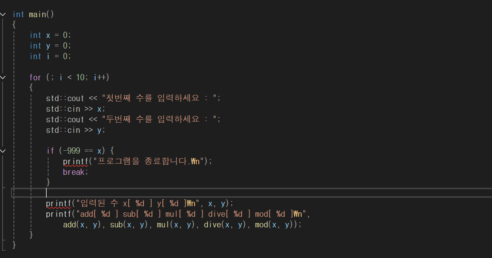
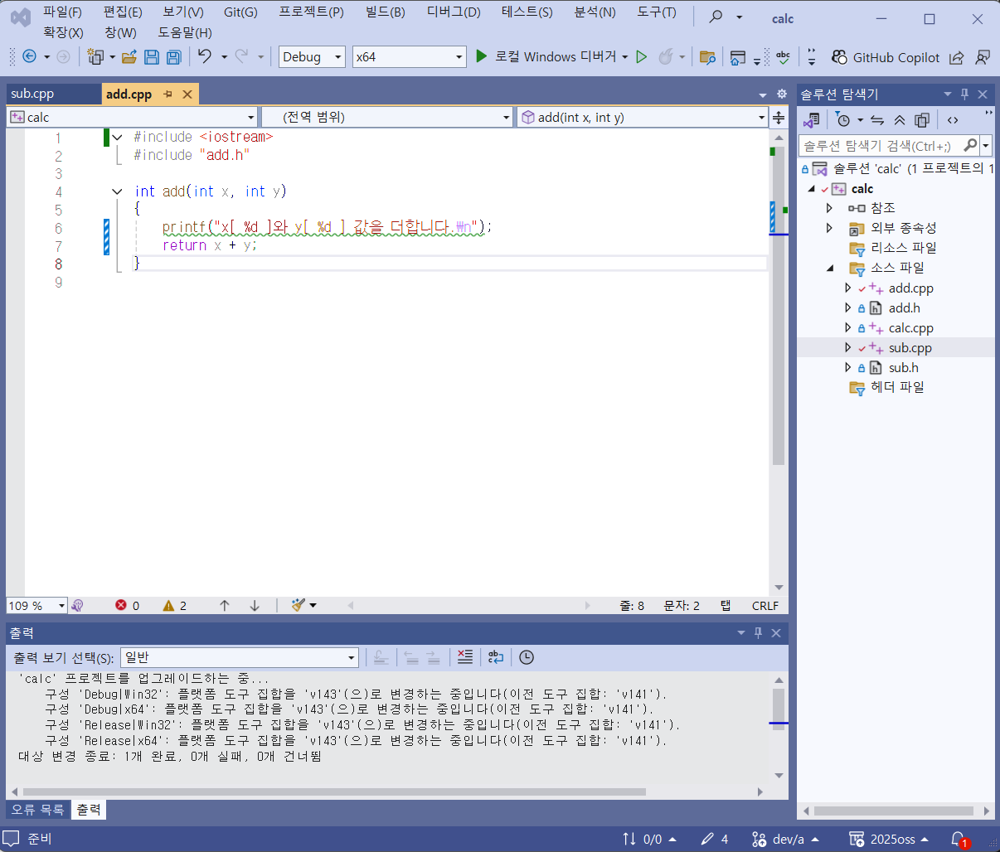
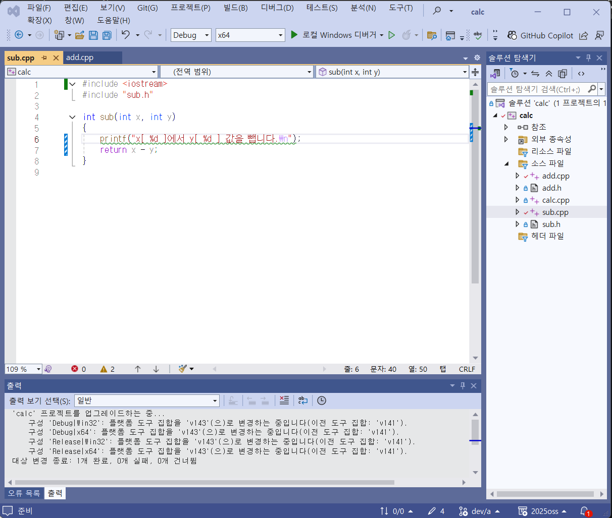

# calc

## OSS 기반 기말 프로젝트

- 저장소: [https://github.com/sdj202207004/2025OSS](https://github.com/sdj202207004/2025OSS)

---

## 팀원 및 역할

| 이름(역할) | 업무 내용 |
|------------|-----------|
| 심동준 (팀장 - 202207004) | main 브랜치 수정 및 병합|
| 강민수 (팀원 - 202207008) | dev/a 브랜치 add.cpp sub.cpp 파일 수정 |
| 조건희 (팀원 - 202107036) | dev/b 브랜치 mod.cpp mul.cpp 및 ReadMe.md 수정 |
| 안재형 (팀원 - 202218024) | dev/c 브랜치 dive.cpp 수정 |

---

## 문제 해결 방법과 순서

1. `main` 브랜치와 `dev/a` 브랜치 병합
2. `main` 브랜치와 `dev/a` 브랜치 병합 중 충돌 발생
3. 충돌 발생한 `dev/a`의 내용을 수정하고 fast-forward 병합 완료
4. `dev/c` 브랜치를 병합 중에 충돌 발생
5. `main` 브랜치의 내용을 수정하고 rebase 병합 완료
6. 결과 화면 캡처하여 실행 화면 캡처
7. `README.md` 수정

---

## 중간과정 수정 스크린샷

### main 브렌치 수정 - 심동준

---

### dev/a 브렌치 수정 - 강민수

---

### dev/b 브렌치 수정 - 조건희

---
### dev/c 브렌치 수정 - 안재형

---

### 2.병합 중 문제 발생
dev/a 병합 중 문제 발생

---

dev/c 병합 중 문제 발생

### 3. 발생한 문제 해결: 코드 수정

---

## Git Flow : 결과 화면

---

## 실행 결과 화면

- 두 수를 입력받아 사칙연산 및 모듈로 연산 수행
- 충돌 해결 과정을 통해 협업과정에서의 Git 이해도 상승

---

